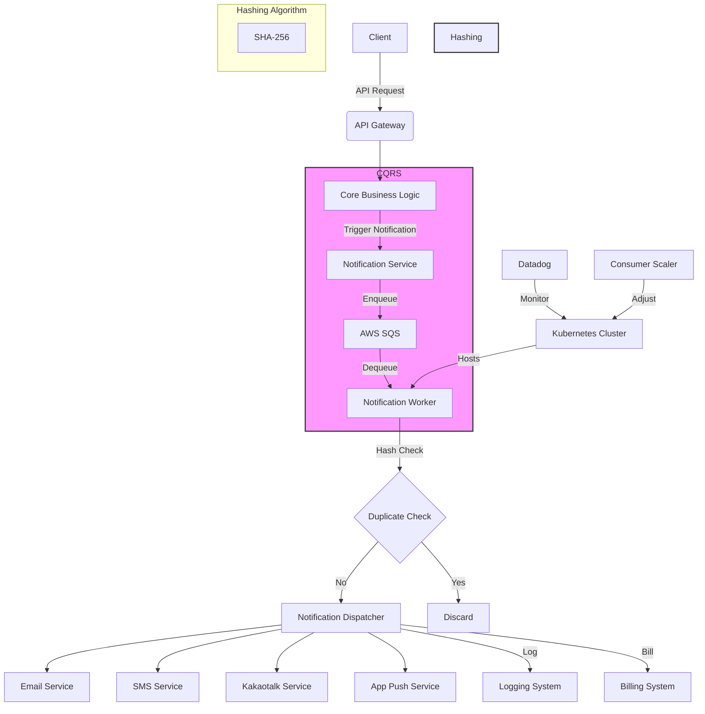

# Notification API (Email, SMS, Kakaotalk(Korean Messaging Service), App Push)

## Project Overview
Developed a unified and efficient notification system to replace individually written PHP services for various notification channels. The new system aimed to operate asynchronously without interfering with core business logic and provide a single point of entry for multiple notification services.

---
This is Notification configuration

## Architecture

## Key Challenges
- Existing PHP notification services interfered with core logic when malfunctioning
- Need for asynchronous operation independent of core logic
- Requirement for a single API call to trigger multiple notification services
- Delays of up to 24 hours in app push notification delivery

## Technical Implementation
- Applied CQRS pattern to queue notification tasks when triggered by core logic
- Implemented data hashing to prevent duplicate notifications
- Set up dedicated notification servers for scalable mass notification dispatch
- Designed system for dynamic scaling of consumers to prevent long-term notification queuing

## Achievements
- Enabled immediate customer interaction with notifications sent by site operators
- Reduced customer notification credit consumption (SMS, Kakaotalk, App Push) by 30% through duplicate prevention
- Enhanced marketing capabilities through improved notification responsiveness
- Prevented server downtime by decoupling notification logic from core business logic

## Technologies Used
- CQRS pattern
- Queue systems
- Hashing algorithms
- Scalable server architecture
